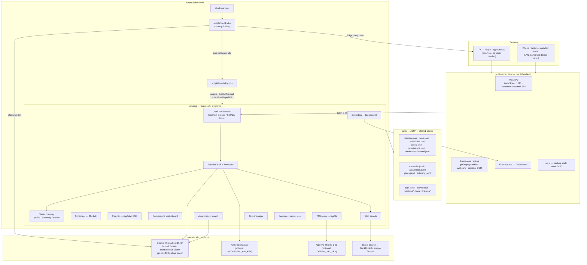
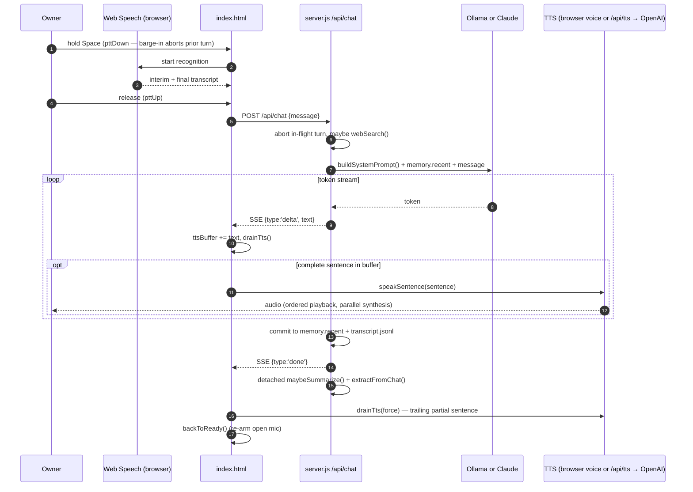

# KAEL — Architecture

> Master architecture document. Everything here is grounded in the actual code:
> `server.js` (~2,230 lines), `public/index.html` (~3,120 lines),
> `scripts/watchdog.mjs` (118 lines), `scripts/KAEL.vbs`, `public/sw.js`.
> Route paths, function names, and field names are quoted from source.

---

## 1. Abstract

KAEL is a single-user, local-first, always-on voice assistant built as exactly two programs plus a supervisor: a Node (Express 5, ESM) server that lives entirely in one `server.js`, and a browser client that lives entirely in one `public/index.html` (vanilla JS, no framework, no build step, installable as a PWA). The only runtime dependencies are `express`, `@anthropic-ai/sdk`, and `dotenv`. The server proxies chat to a free local Ollama model by default (`llama3.2`), with an owner-flippable switch to hosted Claude, an optional OpenAI TTS proxy, and Brave→DuckDuckGo web search. All state is plain JSON / JSONL files under `data/` — memory, tasks, schedules, permissions, transcript, awareness log — written with atomic temp-file-then-rename saves. Every push channel (chat streaming, planner progress, the cross-device event bus) is data-only Server-Sent Events, so the browser talks to the server with nothing but `fetch` and `EventSource`. A watchdog (`scripts/watchdog.mjs`) supervises the server 24/7 with backoff restarts and hung-process detection, and is itself relaunched at login by `scripts/KAEL.vbs`. The whole system is sized to be readable by one person: one server file, one client file, zero framework magic.

---

## 2. System overview



---

## 3. Runtime components

Everything below lives in `server.js` unless it names a client function.

### 3.1 Chat engine (`/api/chat`)

One POST endpoint streams a full turn as SSE (`{type:'delta'}` per token, then `done`). Two backends behind one protocol: `streamFromOllama()` parses Ollama's newline-delimited JSON stream; `streamFromClaude()` uses the Anthropic SDK's `.messages.stream()`. The active backend is the module-level `provider` variable, flipped via `POST /api/provider` (refused without `ANTHROPIC_API_KEY` or when `permissions.paid_claude === false`). **Interrupts, not queuing:** at most one turn streams at a time, but a new request aborts the old one via `activeController.abort()` and waits (bounded 2.5s) on `activeDone` — newest always wins, a wedged turn can never block forever. Errors become spoken-friendly text via `friendlyError()`. On success the turn commits atomically: original (not search-augmented) user message + reply into `memory.recent`, both appended to `transcript.jsonl`, `saveMemory()`, then detached `maybeSummarize()` and `extractFromChat()`.
**Why single-file / why SSE:** the owner can read every line, and SSE is plain HTTP — zero new deps, works through Express and any proxy, and the browser side is just a `fetch` reader loop.

### 3.2 Tiered memory

`memory = { profile, summary, recent }` in `memory.json`, plus the never-trimmed `transcript.jsonl`. Covered in depth in §6. Routes: `GET /api/memory` (peek), `POST /api/memory` (edit profile facts), `GET /api/history` (recent window for UI restore), `GET /api/transcript` (paged/searchable full log), `POST /api/reset` (clear recent; `{all:true}` wipes long-term too).
**Why files, not a DB:** single user, KB-sized state, and `writeFile(tmp) + rename` gives crash-safe atomicity for free.

### 3.3 Web search

`wantsWebSearch()` regex-detects explicit search requests or live-info signals (deliberately *not* bare "today"/"currently" — those caused false searches). `webSearch()` tries `braveSearch()` when `BRAVE_API_KEY` is set, else falls back to `duckDuckGoSearch()` (a keyless HTML scrape). Results are wrapped by `formatResults()` in a `<web_search_results>` block labeled as untrusted data, with `clean()` stripping control chars from snippets — a prompt-injection blunt. `lastSearch` is kept 30 minutes so a follow-up "give me the link" (`wantsUrl()`) can hand back exact URLs without re-searching. All search calls are bounded by timeouts + the turn's abort signal — an unbounded search once wedged the old single-turn lock.

### 3.4 Ambient awareness

The browser sends screen (+ optional webcam) frames to `POST /api/awareness/observe`; `describeActivity()` runs them through a **local** vision model (`qwen2.5vl:3b` default) with `AWARENESS_PROMPT`, producing a one-line note plus an optional `MOOD:` line. Notes land in `awareness.jsonl` (rotated at 5,000 lines by `rotateAwarenessLog()`), the in-memory `recentNotes` tail (12), and `awareness.latestNote/latestMood/latestAt` for the system prompt. Locality is *enforced*: `OLLAMA_IS_LOCAL` + `isCloudModel()` block any configuration where frames would leave the machine unless `AWARENESS_ALLOW_REMOTE=1`. Guards on `observe`: `observing` flag (drop overlaps), `AWARENESS_MIN_MS` throttle (60s), and `activeController` (never evict the chat model from the GPU mid-reply). Frames are never written to disk — except the explicit opt-in training collector (`saveTrainingSample()`, capped at `TRAINING_MAX_SAMPLES` = 500, feeding `scripts/finetune/`).
**Self-improvement:** the `learned` profile (`facts` + `corrections`, `awareness-learned.json`) is injected into every glance via `learnedProfileText()`; `POST /api/awareness/correct` records a user fix, immediately replaces `latestNote`, and re-labels the last training sample via `updateTrainingLabel()`.

### 3.5 Proactive coaching

`coachCheck()` rides along on each glance: it feeds the `recentNotes` timeline (text only, never images) plus the stated `coaching.goal` to `coaching.model` and asks for either the word `QUIET` or one spoken sentence. Per-intensity cooldowns (`COACH_COOLDOWN`: chill 20m / balanced 10m / strict 4m) and a `lastNudge` don't-repeat guard keep it from nagging. Default coach model is `gpt-oss:120b-cloud` — a deliberate, disclosed trade: the 3B local model can't reliably tell drift from focus, and only the text timeline (never frames) goes to it. Configured via `GET/POST /api/coach`.

### 3.6 Conversational task manager

Tasks (`tasks.json`) carry `{id, text, priority, deadline, steps, done, createdAt}`. `addTask()` dedupes by normalized text; `sortedTasks()` orders by open-first / priority / newest. Routes: `GET/POST /api/tasks`, `POST /api/tasks/prioritize` (model re-ranks; registered *before* `/api/tasks/:id` so Express doesn't match "prioritize" as an id), `POST /api/tasks/:id` (all steps done ⇒ task done), `DELETE /api/tasks/:id`, `POST /api/tasks/:id/breakdown` (model generates 3–6 steps). `extractFromChat()` runs after every chat turn behind the `PLAN_HINT` keyword pre-filter and pulls focus, tasks, *and* reminders out of what was said — so "remind me at 5 to email my prof" becomes a schedule without any UI. Every `saveTasks()` broadcasts `task.changed`, keeping every device's panel in sync through one line of code.

### 3.7 Auth + device pairing

An `app.use('/api', …)` middleware: `isLocalReq()` (loopback address) passes free — the desktop stays zero-config. Any other address must present the token via `X-KAEL-Token` header, `?token=` query, or the `kael_token` cookie; `tokenOk()` compares with `crypto.timingSafeEqual`. A valid token refreshes the cookie (`HttpOnly; SameSite=Lax; Max-Age=31536000`) so the PWA and `EventSource` keep working without the query param. The token comes from `KAEL_TOKEN` in `.env` or is generated once into `data/auth.token`. `GET /api/pair` is **localhost-only** (it hands out the token) and returns LAN pairing URLs; the client strips `?token=` from the URL bar after storing it (`history.replaceState`, `index.html` ~line 753). `permissions.remote_access === false` shuts LAN access off entirely. Server binds `127.0.0.1` unless `KAEL_HOST=0.0.0.0` is set deliberately.

### 3.8 Event bus (SSE)

`sseClients` is a `Set` of open responses on `GET /api/events`; `broadcast(type, data)` writes one `data:` line to each. A 25s `health.heartbeat` keeps proxies from timing the stream out and doubles as a liveness signal. Full contract in §7.
**Why SSE over WebSocket:** every message is server→client push (client→server is ordinary POSTs), SSE needs zero dependencies, auto-reconnects in the browser, and speaks the exact same framing `/api/chat` already uses.

### 3.9 Permissions switchboard

Ten boolean keys (`PERMISSION_KEYS`): `remote_access, web_search, paid_claude, paid_tts, awareness, webcam, screen, training, scheduler, planner` — all default **true** (the pre-switchboard behavior), persisted to `permissions.json`, edited via `GET/POST /api/permissions`, changes broadcast as `permissions.changed`. Enforcement lives where the capability lives: server-side for search/Claude/TTS/awareness/scheduler/planner/remote, client-side for `webcam`/`screen` (the browser is where capture happens — `Awareness.start()` and `grabWebcam()` check `perms`).

### 3.10 Scheduler (reminders + routines)

`schedules.json` holds one-offs (`at`) and recurrences (`recur: {kind: daily|weekly|interval, …}`); `computeNextAt()` computes the next slot in the server's local timezone. `scheduleTick()` runs every 30s (and once at boot): due jobs inside the 6-hour `SCHEDULE_MISSED_GRACE` broadcast `schedule.fired` and are appended to the transcript; older ones broadcast `schedule.skipped` with a note instead of being blurted hours late. Recurrences recompute `nextAt`; one-offs disable themselves. CRUD: `GET/POST /api/schedules`, `POST /api/schedules/:id`, `DELETE /api/schedules/:id` — or just say it (chat extraction feeds `addSchedule()`).

### 3.11 Planner

`POST /api/plan` streams SSE: the local model decomposes a goal into ≤5 steps over a fixed tool set — `search`, `remember`, `task`, `remind`, `answer` (exactly one, always last, force-appended if missing). `runPlanStep()` executes sequentially, each best-effort and permission-checked; progress goes both to the caller (`plan`/`step`/`delta` events) and the event bus (`plan.started/plan.step/plan.done`). The final answer is synthesized with the full `buildSystemPrompt()` plus everything gathered. `activePlan` makes it strictly one-at-a-time (409 otherwise); every run is appended to `plans.jsonl` (`GET /api/plans` shows the last 20). Bounded on purpose — this is an errand-runner, not an agent framework.

### 3.12 Premium TTS proxy

`POST /api/tts` forwards one sentence (≤ `TTS_MAX_CHARS` = 1500) to OpenAI `tts-1-hd` and returns MP3 bytes; the API key never reaches the browser. `GET /api/voice` advertises availability + the six voices so the UI only shows the toggle when it will work. Browser disconnect aborts the upstream call (barge-in goes silent immediately).

### 3.13 Data safety

`backupDataStores()` copies the six small JSON stores into `data/backups/YYYY-MM-DD/` daily, pruning past `BACKUP_KEEP_DAYS` = 7. `initServerLock()` heartbeats `data/server.lock` every 30s; a lock present at boot means the previous run died uncleanly (`uncleanShutdown`, surfaced as `recoveredFromCrash` in `/api/health`). `SIGINT`/`SIGTERM` unlink the lock on clean exit. Every store save is the same atomic pattern: serialize → write `.tmp` → `rename` over the real file, chained through a per-store promise (`saving`, `savingConfig`, …) so writes never interleave.

### 3.14 Watchdog + autostart

`scripts/watchdog.mjs` spawns `node server.js`, restarts on exit with exponential backoff (1s → 60s cap, forgiven after 5 minutes of healthy uptime), polls `GET /api/health` every 60s and kills the whole process tree (`taskkill /PID … /T /F`) after 3 consecutive failures, logs to `data/logs/server.log` + `data/logs/watchdog.log` (size-capped rotation), and holds a single-instance lock (`data/watchdog.lock`, heartbeat every 30s — `/api/health` reads it to report `supervised: true`). `scripts/KAEL.vbs` (copied into the Startup folder) starts Ollama hidden, opens the Edge `--app` window once, then loops relaunching the watchdog if *it* ever dies.

### 3.15 Client shell (PWA)

`public/index.html` is the entire client: state machine (`idle → listening → thinking → speaking`, `setState()`), push-to-talk and open-mic capture, sentence-streamed TTS (§5), awareness capture, panels for tasks/schedules/permissions/settings, the `EventSource` consumer, and a tiny hand-rolled markdown renderer (on-screen only — spoken text stays plain). `public/sw.js` makes it installable: network-first for the static shell with cache fallback (window still opens mid-restart), **never** touches `/api/*` or non-GET requests, and only caches `res.ok` responses so an error page can't poison the offline fallback.

### 3.16 Listening mode + health

`POST /api/listen` appends heard-but-not-answered lines to `listening.jsonl` — deliberately outside the model's memory so passive capture never pollutes context (`GET /api/listening` reviews it). `GET /api/health` is the single "how is everything" endpoint: Ollama reachability + model installed, vision model installed, `supervised`, `recoveredFromCrash`, live `devices` count, next schedule, and exposure (`host`, `authRequired`).

---

## 4. Request lifecycles

### (a) A spoken chat turn

1. Owner holds Space (or the orb). `pttDown()` fires: barge-in first — `stopSpeaking()` + abort any in-flight fetch — then `startPtt()` starts `webkitSpeechRecognition`.
2. Finalized words accumulate in `pttTranscript`; interim text renders live. On release, `pttUp()` → `endPtt()` sends the utterance to `handleUtterance()`. (Open-mic mode instead endpoints on `OPEN_ENDPOINT_MS` = 700ms of silence.)
3. `handleUtterance()` routes: listening-mode enter/exit, `plan:` prefix → `runPlan()`, focus phrases → `POST /api/coach`. Otherwise it's a chat turn: state → `thinking`, `POST /api/chat {message}` with a fresh local `AbortController`.
4. Server: any in-flight turn is aborted (`activeController.abort()`, bounded wait on `activeDone`). SSE headers go out.
5. If `wantsWebSearch(message)` and `permissions.web_search` allows, a `status` event ("Searching the web…") is sent and `webSearch()` results are appended to the turn as an untrusted `<web_search_results>` block (this augmentation is never persisted).
6. `buildSystemPrompt()` composes persona + German time + fresh awareness note + profile facts + summary + open tasks; `memory.recent` plus the new message go to `streamFromOllama()` (or `streamFromClaude()`).
7. Each model token becomes an SSE `{type:'delta', text}`. Client appends to the bubble *and* to `ttsBuffer`; `drainTts(false)` regex-extracts complete sentences (`/^[\s\S]*?[.!?…](?=\s|$)/`) and hands each to `speakSentence()` as it completes — speech starts before the reply finishes.
8. `speakSentence()` picks the engine: `Premium.speak()` POSTs the sentence to `/api/tts` immediately (synthesis for several sentences runs in parallel) but chains *playback* in strict order; a generation counter (`Premium.gen`) lets barge-in silence everything queued. Otherwise a `SpeechSynthesisUtterance` on the free browser voice.
9. Stream ends: server commits the turn to `memory.recent` + `transcript.jsonl`, saves, sends `done`, then kicks off detached `maybeSummarize()` and `extractFromChat()` (which may quietly add tasks/reminders/focus).
10. Client: `drainTts(true)` speaks the trailing partial sentence, markdown renders on screen, and when `streamDone && utterancesPending <= 0` the state machine returns to ready (`backToReady()` re-arms open-mic if that mode is on).

### (b) An ambient glance

1. Owner clicks "Start watching": `Awareness.start()` requests `getDisplayMedia({video:{frameRate:1}})` once, keeps the stream, POSTs `{enabled:true}` to `/api/awareness`, and schedules `glance()` every `intervalMs` (default 5 min; the **browser** drives cadence because it owns the stream).
2. `glance()`: `grabScreen()` draws the current frame to a canvas at ≤1280px wide, JPEG q0.72. If the `kael.ocr` localStorage flag is set, Tesseract.js (lazy-loaded, in-browser) reads exact screen text. `grabWebcam()` briefly opens the camera, snaps one ≤640px frame, releases it.
3. Client POSTs `{screen, screenText?, webcam?}` to `/api/awareness/observe` (90s client-side abort so a hung glance can't wedge `busy`).
4. Server guards: awareness enabled; vision model is local (`OLLAMA_IS_LOCAL` / `isCloudModel()`); not already `observing`; past the 60s throttle; **no chat streaming** (`activeController` set ⇒ `202 {skipped:'chat-busy'}` — loading the vision model would evict the chat model from the GPU mid-reply).
5. `describeActivity()` sends prompt + images to Ollama (`awareness.model`, `keep_alive: '10m'`). The reply splits into the activity `note` and an optional `mood`.
6. The note updates `awareness.latestNote/latestMood/latestAt`, appends to `awareness.jsonl`, pushes onto `recentNotes`, optionally saves a training pair, and broadcasts `awareness.note`.
7. `coachCheck()` runs on the same glance: timeline + goal + mood → `coaching.model` → either `QUIET` or one sentence. A nudge is broadcast as `coach.nudge` *and* returned in the response.
8. Client shows the note (with the "✎ that's wrong" correction affordance) and, if `coach` came back, speaks it via `speakCoachNudge()` — which refuses to interrupt a real turn and dedupes against the event-bus copy (`lastNudgeText`, 20s window).

### (c) A reminder firing

1. `scheduleTick()` runs every 30s (plus once at boot for jobs that came due while off).
2. For each enabled schedule with `nextAt <= now`: if it's older than the 6h grace window, `broadcast('schedule.skipped', …)` + a transcript note; otherwise `broadcast('schedule.fired', {id, text})` + transcript line `⏰ Reminder: …` and `lastFiredAt` is stamped.
3. Recurring jobs get a fresh `nextAt` from `computeNextAt()`; one-offs set `enabled = false`.
4. Every connected device's `EventSource` receives the event; the client's `es.onmessage` switch hits `case 'schedule.fired'` and calls `speakCoachNudge('Reminder: ' + msg.text)` — so **every open device speaks the reminder out loud** (unless mid-conversation; the nudge yields to a live turn) and refreshes its schedules panel.

### (d) A plan run

1. Owner says or types "plan: book my train and remind me at 8". `handleUtterance()`'s plan regex matches → `runPlan(goal)` → `POST /api/plan {goal}` (streamed; 409 if `activePlan` is set, 403 if `permissions.planner` is off).
2. Server sends `{type:'status', text:'planning…'}`, then asks the local model (via `localChat()`, `think:false`, temp 0.2) for strict JSON steps over the five tools; `parseJsonLoose()` tolerates fences/prose; invalid tools are filtered; an `answer` step is appended if the model forgot it.
3. `{type:'plan', steps}` goes to the caller and `plan.started` to the bus. Steps execute sequentially through `runPlanStep()`: `search` → `webSearch()` into `gathered`; `remember` → push onto `memory.profile`; `task` → `addTask()`; `remind` → `addSchedule()` with the step's `when`. Each step emits `step` events (caller) and `plan.step` (bus). Failures are recorded and the plan continues.
4. Final synthesis: `localChat()` with `buildSystemPrompt()` + the `gathered` material + the answer step's guidance produces the spoken answer, sent as one `delta`, then `done`; `plan.done` broadcasts; both goal and answer land in the transcript; the run is appended to `plans.jsonl`.
5. Client renders the live step checklist (`○` → `●`), refreshes tasks/schedules panels (steps may have created some), and speaks the answer.

---

## 5. Pipeline diagrams

### Voice pipeline



### Vision (awareness) pipeline

```mermaid
sequenceDiagram
    autonumber
    participant C as index.html (Awareness)
    participant O as OCR (Tesseract.js, opt-in)
    participant S as server.js
    participant V as Ollama vision (qwen2.5vl:3b)
    participant K as coaching.model
    participant D as all devices (/api/events)

    Note over C: every intervalMs (default 5 min)
    C->>C: grabScreen() ≤1280px jpeg + grabWebcam() ≤640px
    opt kael.ocr enabled
        C->>O: read(screen frame)
        O-->>C: exact on-screen text
    end
    C->>S: POST /api/awareness/observe {screen, screenText?, webcam?}
    S->>S: guards — local-model check, throttle, observing, chat-busy
    S->>V: AWARENESS_PROMPT + learnedProfileText() + images
    V-->>S: activity sentence (+ MOOD line)
    S->>S: latestNote/Mood/At · append awareness.jsonl · recentNotes
    S-->>D: broadcast awareness.note
    S->>K: coachCheck() — text timeline only
    K-->>S: QUIET or one sentence
    opt nudge
        S-->>D: broadcast coach.nudge
    end
    S-->>C: {note, mood, at, coach}
    C->>C: show note (+ correction button); speak coach if present
```

---

## 6. Memory architecture

Six tiers, each with a different lifetime and a different job:

| Tier | Store | Bound | Written by | Read by |
|---|---|---|---|---|
| Profile facts | `memory.json` → `profile` | `MAX_PROFILE_FACTS` = 30 | `foldIntoMemory()`, planner `remember`, `POST /api/memory` | Every turn's system prompt |
| Rolling summary | `memory.json` → `summary` | one compact narrative | `foldIntoMemory()` (local model, JSON mode) | Every turn's system prompt |
| Recent window | `memory.json` → `recent` | fold at `SUMMARIZE_TRIGGER` = 24 back to `RECENT_WINDOW` = 16 | each committed chat turn | Sent verbatim as real turns |
| Full transcript | `transcript.jsonl` | unbounded, append-only | `appendTranscript()` (chat, reminders, plans) | `GET /api/transcript` (UI search/paging) — never the model |
| Awareness notes | `awareness.jsonl` + `recentNotes` tail (12) | file rotated at 5,000 lines → half | each glance | coach timeline; latest note → system prompt |
| Learned profile | `awareness-learned.json` (`facts` ≤60, `corrections` ≤100) | replaced by daily consolidation | `/api/awareness/correct`, `/api/awareness/learned` | every vision glance prompt |

**Fold/summarize flow.** After each committed turn, `maybeSummarize()` checks `memory.recent.length > SUMMARIZE_TRIGGER`. If so (and no fold is running — `summarizing` flag), the overflow (everything but the newest 16) goes to `foldIntoMemory()`: a single local-model call in Ollama JSON mode (`format:'json'`, temp 0.2, 90s timeout) that returns `{summary, facts}` — an updated narrative and the *full* replacement fact list. Folded messages are then removed **by identity** (`overflow.includes(m)`), so a turn that landed mid-fold survives in the window. On repeated failure a failsafe hard-trims at 3× the trigger — the raw text is still in `transcript.jsonl`; only the folded summary is lost. Folding always runs on the free local model, so memory upkeep costs zero API tokens even while chatting on Claude.

**What the model sees each turn** (`buildSystemPrompt()`), in order:

1. Persona — `sessionPersona` override or `KAEL_SYSTEM_PROMPT`.
2. Current date/time in `Europe/Berlin` (`germanNow()`), recomputed every turn.
3. The latest awareness note + soft mood — only if fresher than `min(intervalMs × 2.5, 10 min)`; a stale note never reads as "right now".
4. Profile facts (bulleted, "treat as true, don't recite").
5. The rolling summary.
6. Up to 15 open tasks, priority-ordered with deadlines and step progress.

Then `memory.recent` goes as literal chat turns, followed by the (possibly search-augmented) new message. `OLLAMA_CTX` = 8192 keeps all of it inside the local model's window.

---

## 7. Communication protocol — KAEL Protocol v1

All server→client push is **data-only SSE**: every frame is one line, `data: {json}\n\n`, with no `event:` names, no `id:`, no retry hints. Each payload self-describes via a `type` field, and bus events add an `at` ISO timestamp (`broadcast()` injects it). This means one `es.onmessage` handler with a `switch(msg.type)` on the client, identical framing across `/api/chat`, `/api/plan`, and `/api/events`, browser-native auto-reconnect, and zero dependencies — the reasons it won over WebSocket, which would have added a library and buys nothing when the client never pushes over the socket (client→server is ordinary REST).

### Event bus (`GET /api/events`)

| Type | Payload | Emitted when | Client action (`index.html` switch) |
|---|---|---|---|
| `hello` | `devices` | on connect | — |
| `health.heartbeat` | `uptimeSec` | every 25s | — (keeps proxies alive) |
| `task.changed` | `open` count | every `saveTasks()` | refresh tasks panel (if visible) |
| `schedule.changed` | `count` | every `saveSchedules()` | refresh schedules panel |
| `schedule.fired` | `id, text` | scheduler tick, job due | **speak** "Reminder: …" on every device |
| `schedule.skipped` | `id, text, missedAt` | job missed > 6h grace | toast "missed while off" |
| `permissions.changed` | `permissions` | switchboard change | adopt + refresh panel |
| `provider.changed` | `provider` | backend flip | update brain button |
| `awareness.note` | `note, mood` | each successful glance | — (informational; observing device already shows it) |
| `coach.nudge` | `text` | `coachCheck()` speaks up | speak — deduped 20s against the glance response copy |
| `plan.started` / `plan.step` / `plan.done` | `planId, goal, …` | planner progress | — (the caller gets its own stream) |

### Per-request streams

`/api/chat`: `status`, `delta`, `error`, `done`. `/api/plan`: `status`, `plan`, `step`, `delta`, `error`, `done`.

### Auth model

- **Localhost is exempt** — `isLocalReq()` checks the socket's remote address (`127.0.0.1`, `::1`, `::ffff:127.0.0.1`). The PC never sees a token.
- **Everything else on `/api`** must present the device token: `X-KAEL-Token` header (the client's `fetch` wrapper adds it), `?token=` query (what the pairing link and `EventSource` use — `EventSource` can't set headers), or the `kael_token` cookie. Comparison is constant-time (`crypto.timingSafeEqual`); success refreshes the year-long HttpOnly cookie.
- `GET /api/pair` (localhost-only) mints pairing URLs embedding the token; the client stores it in localStorage and scrubs it from the address bar.
- `permissions.remote_access = false` is a kill switch that 403s all non-local requests regardless of token.
- The token itself lives in `KAEL_TOKEN` (.env) or auto-generated `data/auth.token` (24 random bytes, base64url).

---

## 8. Folder structure

```
kael/
├── server.js                  # the entire backend (~2,230 lines) — every subsystem in §3
├── package.json               # deps: express, @anthropic-ai/sdk, dotenv. That's all.
├── .env / .env.example        # keys + overrides (KAEL_HOST, OLLAMA_MODEL, KAEL_TOKEN, …)
├── .gitignore                 # node_modules, .env, and ALL of data/ (personal data never commits)
├── README.md
├── docs/
│   └── ARCHITECTURE.md        # this file
├── public/                    # the entire frontend, served statically
│   ├── index.html             # the whole client (~3,120 lines): voice, awareness, panels, SSE
│   ├── sw.js                  # PWA service worker — network-first shell, never caches /api/*
│   ├── manifest.webmanifest
│   └── icons/                 # icon-192/256/512.png, kael.ico
├── scripts/
│   ├── KAEL.vbs               # login autostart: Ollama → Edge --app → watchdog loop
│   ├── watchdog.mjs           # 24/7 supervisor: backoff restart, health-poll kill, logs
│   └── finetune/              # offline: train a personal vision model from data/training/
│       ├── kael_caption.py
│       └── train_kael.py
└── data/                      # ALL state. Gitignored. KAEL_DATA_DIR can relocate it.
    ├── memory.json            # profile facts + rolling summary + recent window
    ├── config.json            # persona / temperature / model / awareness / coaching settings
    ├── tasks.json             # task manager
    ├── schedules.json         # reminders + routines
    ├── permissions.json       # the capability switchboard
    ├── awareness-learned.json # learned facts + corrections for the vision model
    ├── auth.token             # auto-generated device token (unless KAEL_TOKEN set)
    ├── server.lock            # heartbeat file — present at boot ⇒ unclean shutdown
    ├── watchdog.lock          # watchdog single-instance lock + heartbeat
    ├── transcript.jsonl       # permanent, append-only chat log (never trimmed)
    ├── awareness.jsonl        # activity notes (rotated at 5,000 lines)
    ├── plans.jsonl            # planner run log
    ├── listening.jsonl        # listening-mode capture (kept OUT of model memory)
    ├── backups/YYYY-MM-DD/    # daily copies of the six small JSON stores, 7 days kept
    ├── logs/                  # server.log (5MB cap) + watchdog.log (1MB cap), .1 rotation
    └── training/              # opt-in fine-tune dataset: images/ + labels.jsonl (≤500 samples)
```

---

## 9. Deployment

There is no deployment in the usual sense — KAEL *is* the owner's PC. The supervision chain:

1. **Windows login** runs `KAEL.vbs` from the Startup folder (canonical copy versioned at `scripts/KAEL.vbs`; install = copy it there).
2. The VBS starts **`ollama.exe serve` hidden** (if Ollama is already up, the bind on :11434 fails harmlessly), waits ~10s, opens **one** Edge `--app=http://localhost:3000` window (outside the loop — one window per login, not per relaunch; localhost keeps same-origin `/api/*` and the granted mic permission), then loops: run `node scripts/watchdog.mjs`, and if the watchdog process itself ever exits, relaunch it after 10s.
3. The **watchdog** spawns `node server.js`, and from there owns its lifecycle (§10).

**Ollama dependency.** Chat, memory folding, extraction, planning, and vision all hit `OLLAMA_URL` (default `http://localhost:11434`). `warmUpModel()` preloads the chat model at boot and after model switches (never mid-reply — that would swap models on the GPU under a live stream); `keep_alive` (default `30m`) keeps it resident between turns. If Ollama is down, `/api/health` reports `ollama.up: false` and the client shows "Ollama isn't running" at startup instead of letting the first turn fail mysteriously.

**How updates roll.** `git pull` in `C:\Users\mealf\gh-work\kael`, then kill the node server process — the watchdog relaunches it within a second (first backoff step). The client updates itself: `sw.js` is network-first for the shell, so the next page load fetches the new `index.html`. No build step exists on either side. (Killing the watchdog instead takes the server down with it and the VBS loop brings both back in ~10s.)

---

## 10. Failure recovery

| Failure | Detection | Recovery |
|---|---|---|
| Server crash | watchdog's `child.on('exit')` | Relaunch with exponential backoff 1s → 60s cap; `restarts` resets after 5 min of healthy uptime (`HEALTHY_RESET_MS`) — one-off crashes recover instantly, a broken build can't melt the CPU |
| Server hang (alive, not answering) | watchdog polls `GET /api/health` every 60s, 10s timeout; 3 consecutive failures | `taskkill /PID … /T /F` on the whole tree; the exit handler relaunches. 20s boot grace period avoids killing a starting server |
| Watchdog itself dies | the VBS `Do…Loop` waits on the process | relaunched after 10s; `watchdog.lock` (pid + 90s heartbeat freshness) prevents a duplicate supervisor |
| Corrupt JSON store | `JSON.parse` throws at load | Quarantine, don't destroy: `memory.json`/`schedules.json` are renamed to `*.corrupt` and the server starts fresh; other stores fall back to defaults. Yesterday's copy is in `data/backups/` |
| Half-written file | can't happen by design | every save is `writeFile(*.tmp)` → `rename()` (atomic on the same volume), serialized per store through a promise chain |
| Data loss / bad write | — | `backupDataStores()` copies all six small stores to `data/backups/YYYY-MM-DD/` at boot and every 24h, keeping 7 days |
| Reminders due while KAEL was off | boot-time `scheduleTick()` | fired if within the 6h `SCHEDULE_MISSED_GRACE`; otherwise `schedule.skipped` + a transcript note — never blurted hours late |
| Unclean shutdown (crash / power cut) | `server.lock` still present at next boot (`initServerLock()`) | logged, exposed as `recoveredFromCrash: true` in `/api/health`; clean exits unlink the lock in the `SIGINT`/`SIGTERM` handler |
| Wedged chat turn | next turn's interrupt path | `activeController.abort()` + bounded 2.5s wait on `activeDone` — a stuck turn can never block new ones |
| Awareness silently dying | client-side `fails` counter | after 2 consecutive glance failures the badge flips from "KAEL is watching" to "stalled — click to retry" (this exact silent failure once went unnoticed for days) |
| SSE connection drop (mobile network flip) | `es.onerror` | client closes and reopens the `EventSource` after 8s — browsers don't always auto-reconnect after a network change |
| Log growth | size checks on write | `server.log` rotates at 5MB, `watchdog.log` at 1MB (`rotate()`), `awareness.jsonl` halves at 5,000 lines (`rotateAwarenessLog()`) |

---

## 11. Scalability & limits

KAEL is **single-user by design**, and most of its simplicity comes straight from that assumption. The honest ceilings:

- **One conversation.** `memory`, `provider`, `coaching`, `awareness` are module-level singletons; `activeController` allows exactly one streaming turn (newest interrupts). Two people talking to it would share one brain and interrupt each other.
- **One plan, one glance at a time.** `activePlan` 409s a second plan; `observing` drops overlapping glances. Fine for a person, wrong for a crowd.
- **JSON stores rewrite whole files.** Every `saveTasks()` serializes the entire list. At KB scale this is instant and crash-safe; at thousands of tasks or concurrent writers it would thrash. `GET /api/transcript` reads and filters the whole JSONL file per request — fine for years of one person's chat, not for a fleet.
- **SSE fan-out is a `for` loop** over `sseClients` — perfect for the realistic 2–5 devices, unindexed and per-process beyond that.
- **The GPU is a shared single resource.** The chat model, vision model, and summarizer already coordinate around it (`chat-busy` glance skips, no warm-up mid-reply). More users would need real queueing.

If it ever multi-tenanted, the changes are known and contained: real sessions (the token middleware becomes per-user identity, not one shared secret), per-user `data/` directories or — better — SQLite via the built-in `node:sqlite` (keeping the zero-dependency rule) for tasks/schedules/transcript with proper indexes, per-user event-bus channels instead of one global `broadcast()`, and a job queue in front of Ollama. None of that is worth building today: the entire point of the current shape is that one person can read, trust, and repair every line of it.
